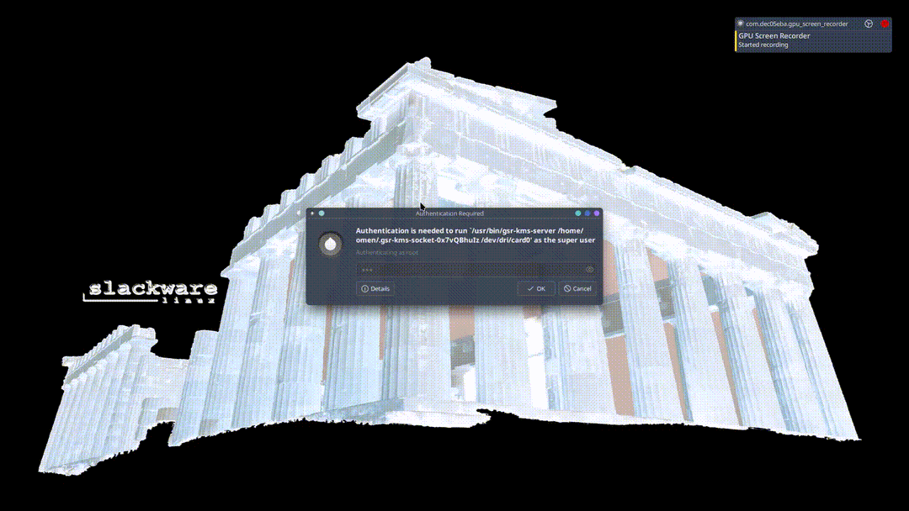
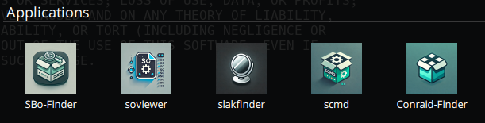
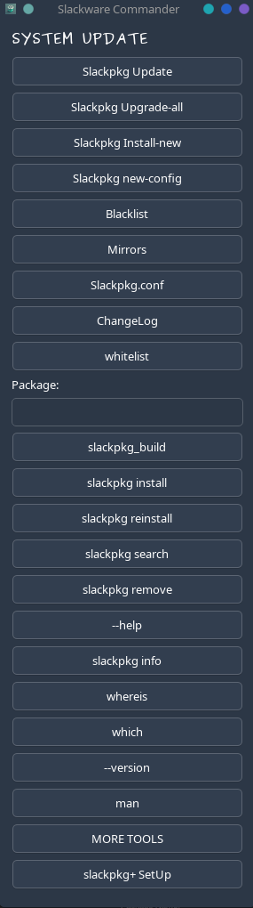
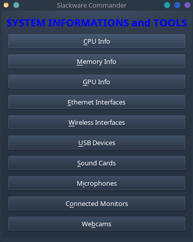
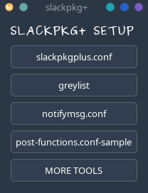
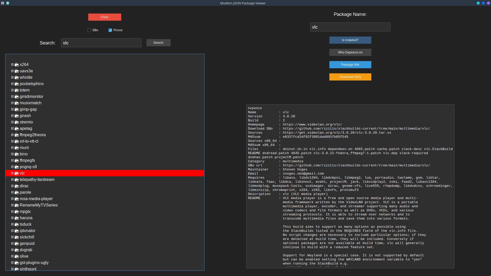
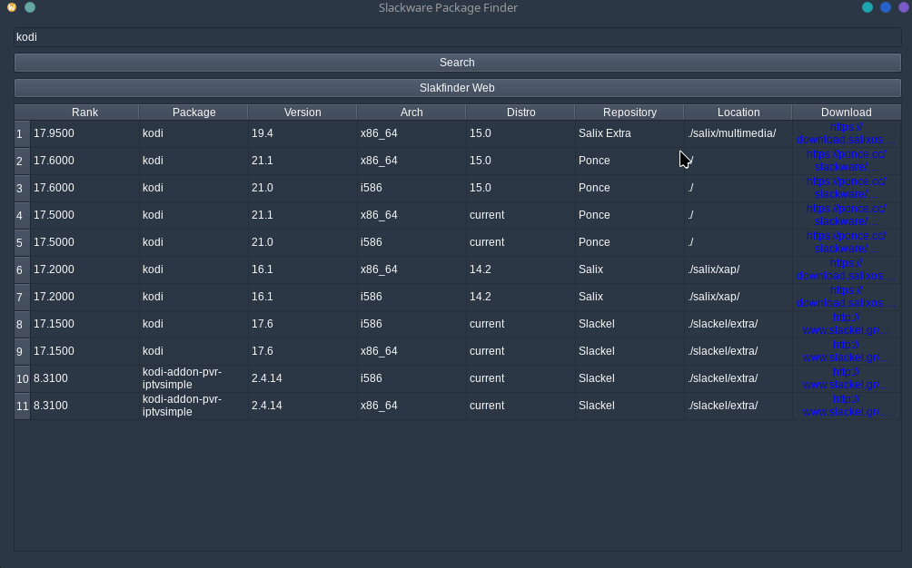
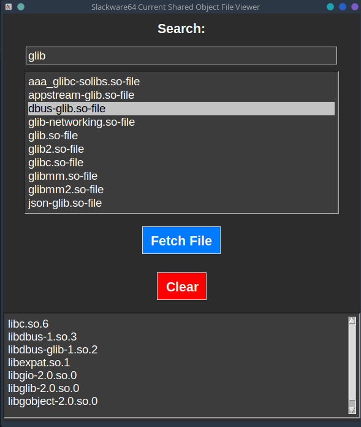
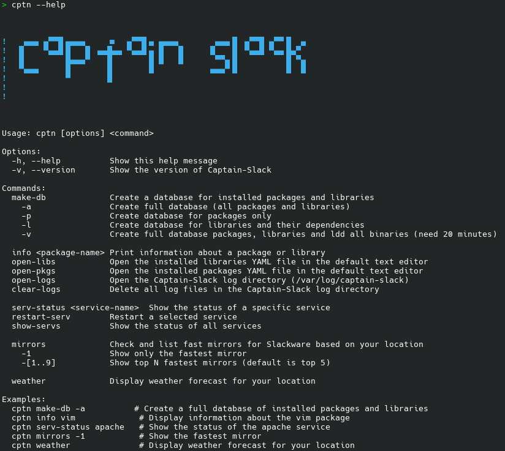

**App is written from scratch in a modern but *KISS* Qt6 gui**<br>
Preferred system for Slackware-Commander is `Slackware64-Current and qmake6`.


### Installation
Please Install requires from SBo/Ponce<br>
- **Assume** you have a **full Slackware installation** and you use **slpkg**:
`slpkg -i yq 
jq 
chafa 
figlet`
- `wget -c https://github.com/rizitis/Slackware-Commander/releases/download/scmd-6.4.0/scmd.SlackBuild.tar.gz`
- `tar -xf scmd.SlackBuild.tar.gz && cd scmd.SlackBuild || exit`
- `wget -c https://github.com/rizitis/Slackware-Commander/archive/refs/tags/scmd-6.4.0.tar.gz`
- `pip install -r requirements.txt`
- ` su -c "bash scmd.SlackBuild"`
- `su -c "upgradepkg --install-new --reinstall /tmp/scmd-6.4.0-x86_64-1_SC.tgz"`
<br>Note: *Slackware-Commander* has `slpkg` as dependency for **sbofinder**. `yq  jq  chafa` for **cptn**. `figlet` for **inxifetch**.   

### Usage: 
Please `man scmd` for details...<br>
*For first time installtion to create a database command `cptn make-db -a` need some time...*

GUI APPs  desktop entries are:<br>


--- 
**scmd** <br>

---

---

---
**sbofinder**

---
**slakfinder**

---
**conraidfinder**

---
**soviewer**

---
**cptn**<br>

---
<br>
[Video1 asciicast](https://asciinema.org/a/5tMTWMcjqFDPoFgMhXQI6DuHi) <br>
[Video2 asciicast](https://asciinema.org/a/5ncBnzP5Z0grVP2xigJNF2IDJ)


---
Slackware is a trademark of Patrick Volkerding.
http://www.slackware.com/trademark/trademark.php

Icons are from:<br>
[uxwing](https://uxwing.com/license/)<br>
<br>
https://uxwing.com/ <br>

And [DALL·E](https://chatgpt.com/g/g-2fkFE8rbu-dall-e)


Thank you, thank you, thank you!

---

[CURRENT.WARNING](http://ftp.slackware.com/pub/slackware/slackware64-current/CURRENT.WARNING)

```
Standard disclaimer follows... putting this back since some folks forgot ;-)

Welcome to Slackware-current!

*** upgradepkg aaa_glibc-solibs before other      ***
*** packages. Take care not to miss new packages: ***
*** upgradepkg --install-new  is (as always) the  ***
*** safest approach.                              ***

Slackware-current is a snapshot of the active Slackware development tree.
It is intended to give developers (and other Linux gurus) a chance to test
out the latest packages for Slackware. The feedback we get will allow us
to make the next stable release better than ever.

See the ChangeLog.txt for a list of changes in Slackware-current.

Please note that the code in this directory is unstable. It might be 
inconsistent about which version of the Linux kernel is required, could be
incomplete because it's in the process of being uploaded, or might not work
for other reasons. In most cases, we know about these things and are working
to correct them, but still -- feel free to point out the bugs.

Production use is AT YOUR OWN RISK and is not recommended.

Security is NOT GUARANTEED. In -current, forward progress often takes
priority. Security fixes take time and resources, and would often have to
be done more than once. It's more efficient to build the system and secure
it as time permits and/or the development cycle nears completion.

We do not promise to issue security advisories for Slackware-current.

Slackware-current might DELETE FILES WITHOUT WARNING when packages are
upgraded. (If, for example, a directory location is replaced by a symbolic
link to a new location.) Upgrade packages carefully. Examine incoming
updates first if your machine's data is not expendable. Again, we do not
recommend using Slackware-current to store or process valuable data.
It is a system in testing, not one that is ready to go (though often it does
work just fine... BUT DON'T COUNT ON IT) 

#include BSD license warranty disclaimer here...

Enjoy! :)

---
Patrick J. Volkerding
volkerdi@slackware.com
```
